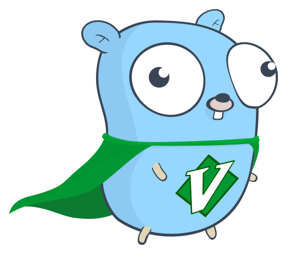

# Hi there 👋

  

---

## About Me

My name is Alex and I am a Senior Software Engineer at [Talon.one](https://github.com/talon-one/) 🚀

I love Golang and Neovim! 

---

## Technologies I Enjoy

### Languages

### Tools & Platforms

### Editors & OS

---

## Connect with Me

---

## Projects

### [Gosanta](https://github.com/Torwalt/gosanta)
A small golang service to explore hexagonal design patterns & DDD in Golang.

---

Thanks for visiting! Have a great day! 🤓
